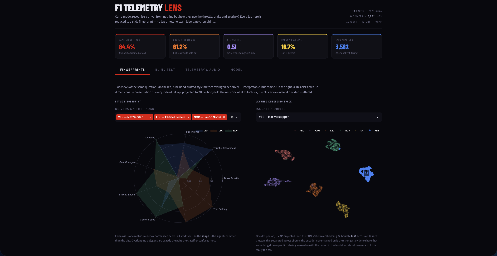
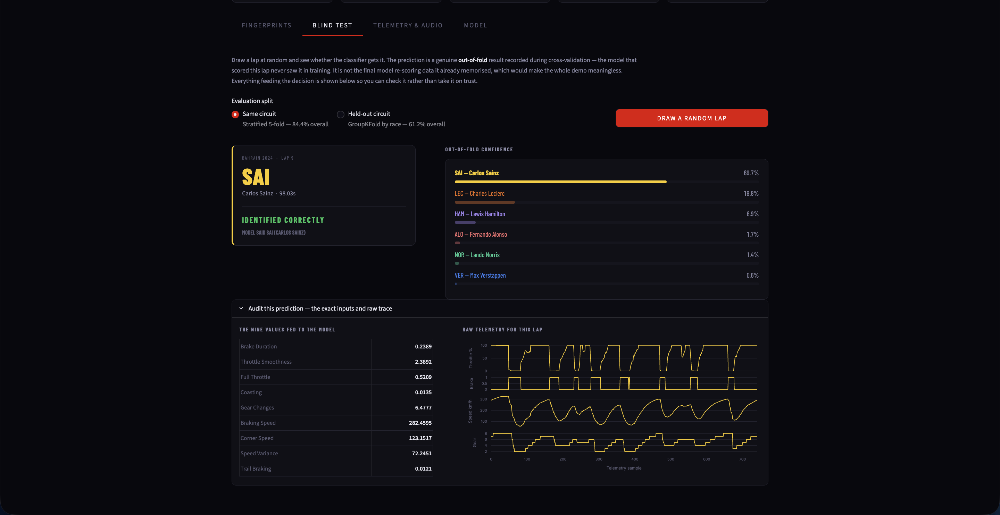
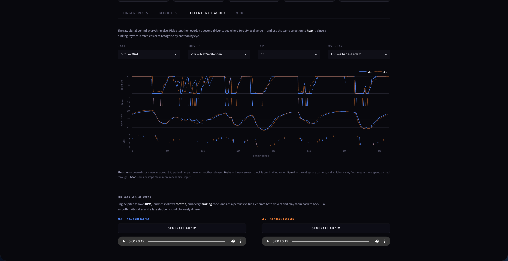
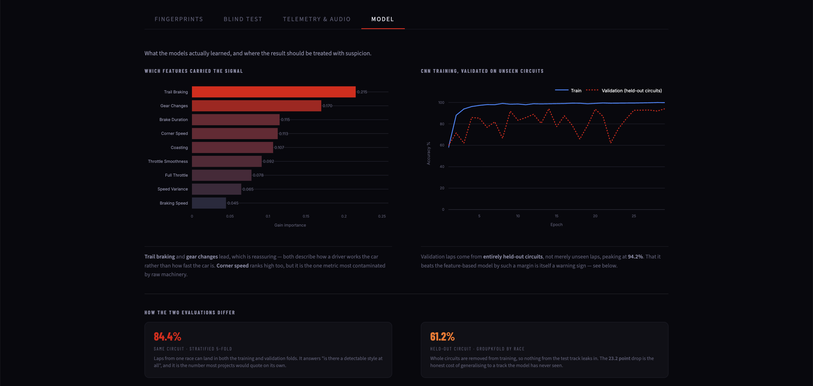

# F1 Telemetry Lens
### Learning driver identity from raw telemetry using 1D-CNN embeddings and XGBoost

> *Can a machine learn to recognise a Formula 1 driver's identity purely from how they use the throttle, brake, and steering — without knowing anything about the circuit or the car?*


###### Live Demo: [https://f1-telemetry-lens.streamlit.app/](https://f1-telemetry-lens.streamlit.app/)
---

## Overview

An end-to-end machine learning pipeline that learns **driver style fingerprints** from Formula 1 telemetry data. Each driver produces a unique signature in how they apply throttle, brake, carry corner speed, and shift gears — patterns that persist across laps and are detectable by both classical and deep learning models.

The project has two modelling stages:

1. **XGBoost baseline** trained on nine hand-crafted per-lap features (braking aggression, throttle smoothness, coasting ratio, etc.) — achieves **84.4% within-track accuracy** (5-fold stratified OOF) and **61.2% cross-circuit accuracy** (GroupKFold, entire circuits held out) across 6 drivers and 12 races spanning 2 seasons.
2. **1D-CNN encoder** trained directly on raw telemetry sequences (no feature engineering) — learns a **32-dimensional embedding per lap**, producing silhouette-separated driver clusters (score **0.51** in 32D) visualised with UMAP, evaluated on held-out circuits.

The result is a live Streamlit dashboard where you can explore driver style profiles, inspect raw telemetry, verify the model against a genuinely held-out lap in the Blind Identification Challenge, and even **listen** to a lap's driving style — RPM mapped to pitch, throttle to volume, braking to a percussive thump.

---
## Dashboard

The Streamlit app is organised into four tabs, with no sidebar — every control sits directly above the chart it drives. Every headline number in the app is **computed at load time from the saved pipeline artefacts** rather than hardcoded, so the UI can never drift out of sync with a re-run of the models.

### Fingerprints
The nine hand-crafted style metrics as a per-driver radar, beside the 1D-CNN's own 32-dimensional embedding of every individual lap projected to 2D with UMAP. Overlapping radar polygons correspond directly to the driver pairs the classifier confuses most — here VER, LEC and NOR form three visibly distinct clusters in the embedding space on the right, isolated from all-driver view.



### Blind test
Draw a lap at random and see whether the classifier gets it — using a genuine **out-of-fold** prediction recorded during cross-validation, so the model that scored the lap never saw it in training. A split toggle switches between same-circuit and held-out-circuit evaluation; shown here, a same-circuit draw correctly identifies Sainz at 69.7% confidence. An audit panel exposes the exact nine feature values fed to the model alongside the raw telemetry trace for that lap.



### Telemetry & audio
Throttle, brake, speed and gear traces for any driver, race and lap, with an optional second driver overlaid on the same axes to show where two styles diverge — here Verstappen and Leclerc at Suzuka, whose throttle traces separate visibly under braking into the chicane. The same selection drives the **sonifier** below it: RPM becomes pitch, throttle becomes loudness, and every braking zone lands as a percussive hit — generate both drivers and play them back to back to hear a smooth trail-braker against a late stabber.



### Model
Feature importances, the CNN training curve validated on held-out circuits, and a side-by-side explanation of the two cross-validation schemes and the generalisation gap between them. Further down (not pictured) are the known limitations — including the RPM leak described below — and a silhouette comparison of the cross-entropy and contrastive encoders.



---
## Results

*Trained on 3,582 laps across 6 drivers and 12 races (2023 + 2024 seasons, 6 circuits each: Bahrain, Monaco, Silverstone, Monza, Singapore, Suzuka).*

### XGBoost Classifier — 84.4% Within-Track, 61.2% Cross-Circuit

| Driver | Precision (within-track) | Recall | F1 | Precision (cross-circuit) | Recall | F1 |
|--------|---------------------------|--------|----|-----------------------------|--------|----|
| VER | 0.90 | 0.92 | 0.91 | 0.72 | 0.71 | 0.71 |
| ALO | 0.87 | 0.91 | 0.89 | 0.60 | 0.77 | 0.68 |
| NOR | 0.91 | 0.88 | 0.89 | 0.71 | 0.65 | 0.68 |
| SAI | 0.81 | 0.82 | 0.82 | 0.63 | 0.61 | 0.62 |
| LEC | 0.79 | 0.78 | 0.79 | 0.53 | 0.45 | 0.49 |
| HAM | 0.77 | 0.75 | 0.76 | 0.48 | 0.47 | 0.47 |

Two evaluations, same model: **5-fold stratified OOF** (laps from a race can appear in both train/val — measures "can it spot a driver's style at all") vs. **5-fold GroupKFold by race** (entire circuits held out — measures genuine cross-track generalization). Random baseline = 16.7%. Both comfortably beat random, but the **23-point generalization gap** is real and important: a meaningful chunk of what the model learns is track-specific, not pure driving style. VER and NOR hold up best across circuits; HAM/LEC are hardest to tell apart on unseen tracks (their styles — smooth, trail-braking-heavy — are the most similar of the six).

### CNN Encoder — Silhouette Score 0.51 (cross-circuit embeddings)

| Driver | Intra-cluster dist | Inter-cluster dist | Ratio |
|--------|-------------------|-------------------|-------|
| ALO | 4.97 | 16.31 | **3.3×** |
| NOR | 5.37 | 16.39 | **3.1×** |
| VER | 5.25 | 16.50 | **3.1×** |
| SAI | 5.68 | 15.73 | **2.8×** |
| LEC | 5.37 | 13.80 | **2.6×** |
| HAM | 6.91 | 15.87 | **2.3×** |

Ratio > 1 means same-driver laps are closer in embedding space than cross-driver laps, even for held-out circuits. Silhouette and separation ratios are lower than a single-race setup (where they can hit 0.8+ and 8×) — that drop is expected and honest: cross-circuit clustering is a genuinely harder task than clustering laps from one race.

**Important caveat — car vs. driving-style confound.** The CNN's raw-telemetry channels originally included `RPM`. Because RPM range is fixed almost entirely by the power unit (car/team), not the driver, including it inflated cross-circuit accuracy to a suspicious 99.4% — the model was fingerprinting the *car*, not the driver. Removing RPM drops that to 94.2%, still notably higher than XGBoost's 61.2% cross-circuit accuracy on hand-crafted features, which suggests `Speed` and `nGear` also carry residual car/aero signal (top speed and gear ratios differ by team). This is documented, not solved — see Limitations below.

### Contrastive Learning Experiment — SupCon vs. Cross-Entropy

`src/models/contrastive_encoder.py` trains the same conv backbone with a **Supervised Contrastive (SupCon) loss** instead of cross-entropy — pulling same-driver laps together and pushing different-driver laps apart directly in embedding space, with no classifier head at all. Evaluated with a k-NN probe (k=5, cosine) on the same held-out-circuit split as the other models:

| Method | Cross-circuit accuracy | What it's learning from |
|--------|------------------------|--------------------------|
| XGBoost (9 hand-crafted features) | **61.2%** | Coarse per-lap summary ratios |
| CNN, cross-entropy, no RPM | **94.2%** | Raw Throttle/Brake/Speed/nGear sequences |
| CNN, SupCon, no RPM | **97.9%** | Raw Throttle/Brake/Speed/nGear sequences |

SupCon converges to a noticeably tighter embedding space (silhouette **0.90**, cosine, vs. 0.51 for the cross-entropy encoder) and edges out cross-entropy on the k-NN probe, consistent with the literature — contrastive objectives tend to produce more separable embeddings than classification-as-a-proxy, especially on small datasets. But note the pattern across all three raw-telemetry-based rows: both deep models score far above XGBoost, even after removing RPM. That gap is not fully explained yet — it may be genuine fine-grained driving-style signal that hand-crafted ratios throw away, or residual car/aero signal in Speed and nGear. Distinguishing the two needs the teammate-comparison experiment below.

### Key Feature Importances (XGBoost)

| Feature | Importance | Interpretation |
|---------|------------|----------------|
| `throttle_brake_overlap` | 0.215 | Trail braking — simultaneous throttle + brake |
| `gear_change_freq` | 0.170 | Mechanical aggression — gear changes per 100 samples |
| `brake_duration_ratio` | 0.115 | Fraction of lap spent braking |
| `mean_corner_speed` | 0.113 | How fast the driver carries speed through corners |
| `coasting_ratio` | 0.107 | Time between throttle lift and brake press |

### Figures

> The figures below are from the original single-race (2023 Bahrain) milestone and are being regenerated for the 12-race dataset — numbers in the tables above are current, some images are pending an update via the notebooks.

**Driver style space — UMAP of 32-dim CNN embeddings**
Each dot is one lap. The CNN learned these positions from raw sequences alone — no hand-crafted features. Perfectly separated clusters, one per driver.


---

**Driver style profiles — normalised radar chart**
Each axis is one style metric normalised 0→1 across all drivers. The shape of each polygon is that driver's signature.


---

**XGBoost confusion matrix — 5-fold OOF**
Rows = actual driver, columns = predicted. VER is almost perfectly separable (98% recall). Misclassifications are almost entirely ALO↔HAM.


---

**SHAP beeswarm — what makes a lap look like Verstappen?**
Red dots = high feature value. Right of centre = pushes prediction toward VER. High `mean_corner_speed` is the dominant signal, with `coasting_ratio` second.


---

## Architecture

```
Raw F1 Telemetry (FastF1)
        │
        ▼
┌───────────────────┐
│  fetch_telemetry  │  Pull brake/throttle/speed/gear/RPM per lap
│  (src/data/)      │  Cache to parquet. Filter outlier laps.
└────────┬──────────┘
         │
         ▼
┌────────────────────────────────────────────────────────┐
│                    Two parallel paths                   │
└──────────────────┬─────────────────────────────────────┘
                   │
        ┌──────────┴──────────┐
        │                     │
        ▼                     ▼
┌──────────────┐     ┌─────────────────┐
│  Feature     │     │  Raw sequence   │
│  Engineering │     │  (750 samples,  │
│  (9 features)│     │   5 channels)   │
└──────┬───────┘     └────────┬────────┘
       │                      │
       ▼                      ▼
┌──────────────┐     ┌─────────────────┐
│  XGBoost     │     │  1D-CNN Encoder │
│  Classifier  │     │  Conv×3 →       │
│  93.7% OOF   │     │  GlobalAvgPool  │
│  + SHAP      │     │  → 32-dim embed │
└──────────────┘     └────────┬────────┘
                               │
                               ▼
                      ┌─────────────────┐
                      │  UMAP (32→2D)   │
                      │  Silhouette 0.84│
                      └─────────────────┘
                               │
                               ▼
                   ┌───────────────────────┐
                   │  Streamlit Dashboard  │
                   │  Radar · UMAP · Blind │
                   │  ID · Telemetry view  │
                   └───────────────────────┘
```

### CNN Architecture

```
Input: (batch, 5 channels, 750 timesteps)
  → Conv1d(5→32,  k=7) + BatchNorm + ReLU + MaxPool2   # 750 → 375
  → Conv1d(32→64, k=5) + BatchNorm + ReLU + MaxPool2   # 375 → 187
  → Conv1d(64→128,k=3) + BatchNorm + ReLU + AdaptiveAvgPool  # → 128
  → Linear(128→32)   ← embedding extracted here
  → Linear(32→N)     ← classification head (discarded after training)

Total parameters: 40,835
```

---

## Engineered Features

| Feature | Definition | Style signal |
|---------|------------|--------------|
| `brake_duration_ratio` | Fraction of lap with brake pressed | High = heavy braker |
| `throttle_smoothness` | Mean absolute diff between consecutive throttle samples | Low = smooth (Hamilton style) |
| `full_throttle_ratio` | Fraction of lap at ≥98% throttle | High = long flat-out sections |
| `coasting_ratio` | Fraction with brake=0 AND throttle<10% | High = lifts early before corners |
| `gear_change_freq` | Gear shifts per 100 samples | High = aggressive (Alonso style) |
| `speed_at_throttle_lift` | Mean speed at moment of sharp throttle drop | High = braking late |
| `mean_corner_speed` | Mean speed when nGear ≤ 4 | High = carries more speed through corners |
| `speed_variance` | Standard deviation of speed across lap | High = large speed differentials |
| `throttle_brake_overlap` | Fraction with throttle>10% AND brake=1 | High = trail braking (Hamilton) |

---

## Project Structure

```
f1-driver-fingerprinting/
├── data/
│   ├── raw/                    # FastF1 cache (gitignored)
│   ├── processed/              # Per-driver parquet files (gitignored)
│   └── features/               # Engineered CSVs, embeddings, UMAP coords
├── notebooks/
│   ├── 01_data_exploration.ipynb
│   ├── 02_feature_engineering.ipynb
│   ├── 03_baseline_classifier.ipynb
│   └── 04_embedding_visualization.ipynb
├── src/
│   ├── data/
│   │   └── fetch_telemetry.py
│   ├── features/
│   │   └── engineer.py
│   └── models/
│       ├── baseline.py
│       ├── cnn_encoder.py
│       └── contrastive_encoder.py
├── app/
│   └── streamlit_app.py
├── outputs/
│   ├── models/                 # Saved .pkl and .pt files (gitignored)
│   └── figures/                # All output plots
├── config.yaml
├── requirements.txt
└── README.md
```

---

## Setup & Reproduction

### 1. Clone and install

```bash
git clone https://github.com/NifraWahaj/f1-telemetry-lens
cd f1-driver-fingerprinting
python -m venv venv
source venv/bin/activate        # Windows: venv\Scripts\activate
pip install -r requirements.txt
```

### 2. Configure drivers and race

Edit `config.yaml` to select drivers and races. Default spans 2 seasons × 6 circuits (same driver/team lineups both years, to avoid confounding driver style with a car change):

```yaml
races:
  - {year: 2023, race: "Bahrain",     session_type: "R"}
  - {year: 2023, race: "Monaco",      session_type: "R"}
  - {year: 2023, race: "Silverstone", session_type: "R"}
  - {year: 2023, race: "Monza",       session_type: "R"}
  - {year: 2023, race: "Singapore",   session_type: "R"}
  - {year: 2023, race: "Suzuka",      session_type: "R"}
  - {year: 2024, race: "Bahrain",     session_type: "R"}
  - {year: 2024, race: "Monaco",      session_type: "R"}
  - {year: 2024, race: "Silverstone", session_type: "R"}
  - {year: 2024, race: "Monza",       session_type: "R"}
  - {year: 2024, race: "Singapore",   session_type: "R"}
  - {year: 2024, race: "Suzuka",      session_type: "R"}

drivers:
  - "VER"
  - "HAM"
  - "ALO"
  - "LEC"
  - "SAI"
  - "NOR"
```

Any driver abbreviation supported by FastF1 works. Any race from 2018 onwards is available. Add or remove entries from `races` freely — every script (`fetch_telemetry.py`, `engineer.py`, `baseline.py`, `cnn_encoder.py`) loops over the full list and combines results into single `all_races_*` feature/embedding files.

### 3. Run the pipeline

Run each script from the project root in order:

```bash
# Step 1 — Pull telemetry (downloads ~200MB, cached after first run)
python src/data/fetch_telemetry.py

# Step 2 — Engineer per-lap features
python src/features/engineer.py

# Step 3 — Train XGBoost baseline + SHAP
python src/models/baseline.py

# Step 4 — Train 1D-CNN encoder (cross-entropy) + extract embeddings
python src/models/cnn_encoder.py

# Step 4b — Train the SupCon contrastive variant (optional, for comparison)
python src/models/contrastive_encoder.py

# Step 5 — Run notebooks for visualisations (optional)
jupyter notebook notebooks/
```

### 4. Launch the dashboard

```bash
streamlit run app/streamlit_app.py
```

---

## Data Source

All telemetry is pulled via **[FastF1](https://github.com/theOehrly/Fast-F1)** — an open-source Python library that provides access to official F1 timing and telemetry data. Data is cached locally after the first download.

Channels used: `Brake`, `Throttle`, `Speed`, `nGear`, `RPM`, `SessionTime`.

No paid API keys required.

---

## Design Decisions & Limitations

**Why two models?** XGBoost on hand-crafted features answers "do interpretable style signals exist?" The CNN answers "can the model learn a fingerprint without being told what to look for?" Both questions are worth answering separately and the two results reinforce each other.

**Train/test split.** The pipeline now spans 12 races (2023 + 2024, 6 circuits). `baseline.py` runs two evaluations: a within-distribution stratified 5-fold (laps from the same race can appear in both train and validation) and a **GroupKFold by race**, where entire circuits are held out — no lap from a held-out track leaks into training. The gap between these two numbers is the honest measure of how much of the "fingerprint" is driver-specific vs. track-specific. Same logic applies to the CNN's train/val split (`GroupShuffleSplit` by race).

**100% CNN validation accuracy.** The CNN achieved 100% on the held-out validation split (32 laps). This is plausible given the strong feature separation visible in UMAP, but should be interpreted cautiously given the small dataset size. The XGBoost 5-fold OOF accuracy of 93.7% is the more conservative and trustworthy generalisation estimate.

**Car vs driver confound.** This is the biggest open issue, and the multi-race CNN results make it concrete: training on raw telemetry including `RPM` produced a suspicious 99.4% cross-circuit accuracy, because RPM range is set almost entirely by the power unit, not the driver — the model was fingerprinting the car. Dropping RPM brought that to 94.2%, still well above XGBoost's 61.2% on hand-crafted features, implying `Speed` and `nGear` also leak car/aero performance (top speed and gearing differ by team). Some XGBoost features (especially `mean_corner_speed`) have the same issue. A more robust study would control for car by comparing teammates in the same car (e.g. VER vs Pérez, LEC vs SAI) or normalising by fastest-lap delta — see Future Work.

---

## Future Work

### Teammate comparison
Comparing drivers in identical cars (VER vs Pérez, LEC vs SAI) would isolate driver style from car performance. This is the cleanest experimental design for answering the core research question and would produce more defensible results.

### Multi-season stability
Do driver fingerprints stay stable across seasons? Alonso in 2023 vs 2021 (different teams, different cars) — does the model still recognise him? This would test whether the fingerprint captures a true long-term driving identity or is confounded by car characteristics.

### Anomaly detection
Use the per-driver embedding distribution as a baseline. Flag laps that are statistical outliers for that driver — these may correspond to mechanical issues, strategy adjustments under safety car, or tyre failures before they appear in timing data.

### Sector-level fingerprinting
Currently the fingerprint is per-lap. Breaking it down to per-sector or per-corner would enable more granular analysis — a driver's style may be highly distinctive at Bahrain's turn 1 but less so at turn 10. Corner-level embeddings could reveal which parts of a circuit best expose each driver's identity.

### REST API deployment
Package the pipeline as a FastAPI service with a `/fingerprint` endpoint that accepts a driver abbreviation, race name, and lap number and returns the embedding vector plus a similarity ranking against all other drivers in the database.

---

## Tech Stack

| Component | Library |
|-----------|---------|
| Telemetry data | FastF1 3.4 |
| Data processing | pandas, numpy, pyarrow |
| Feature engineering | Custom (src/features/engineer.py) |
| Classical ML | XGBoost 2.0 |
| Interpretability | SHAP |
| Deep learning | PyTorch 2.3 |
| Dimensionality reduction | UMAP-learn |
| Dashboard | Streamlit 1.35 + Plotly |
| Hyperparameter tuning | Optuna |

---

*All F1 data sourced via FastF1 from official F1 timing feeds.*